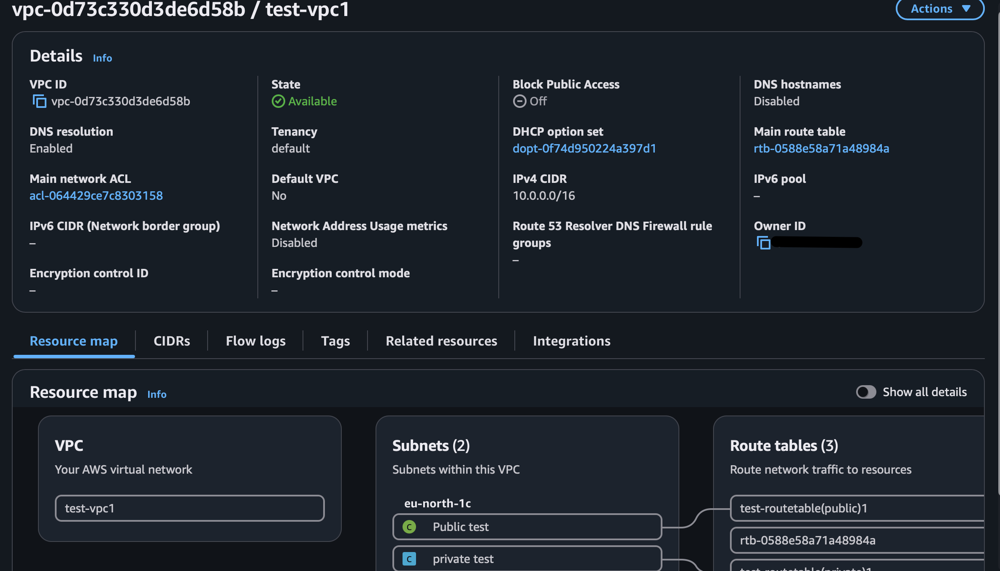
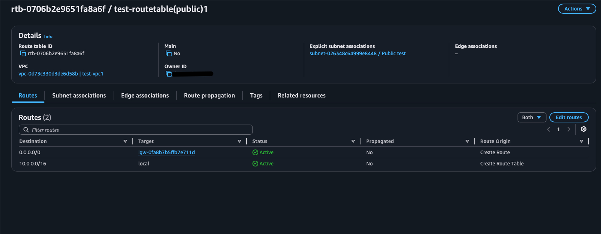
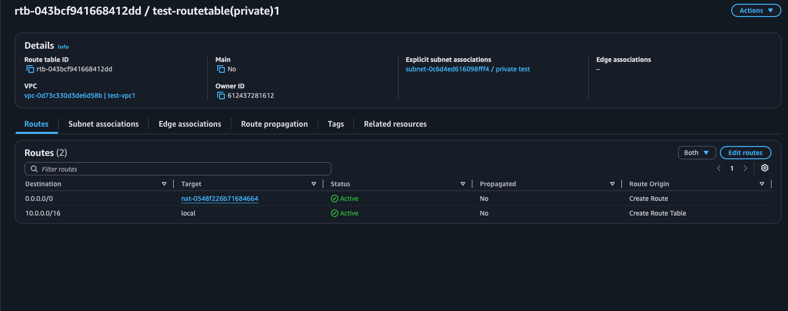
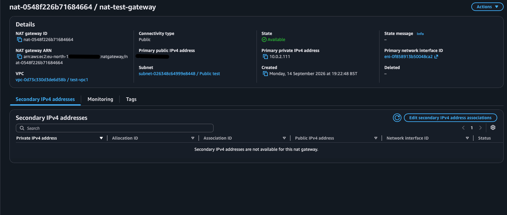
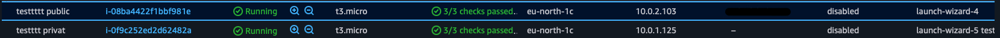
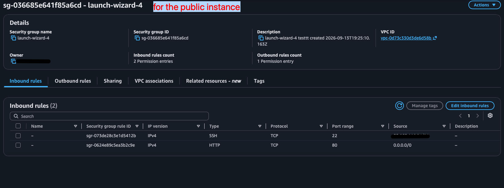
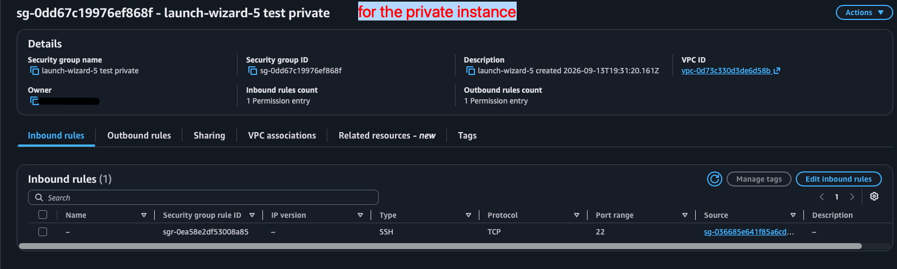
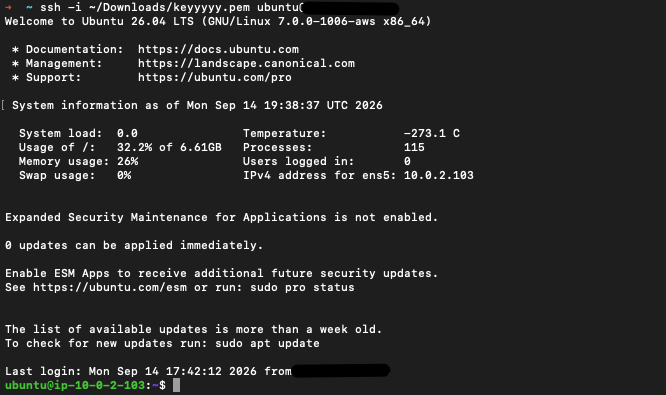
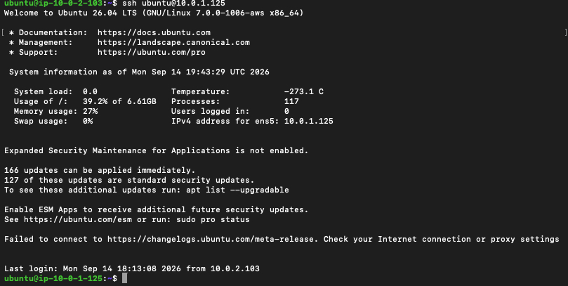

# AWS VPC & Networking Lab

## Overview

This project demonstrates the design and implementation of a custom AWS VPC containing public and private subnets.

The objective was to build a network where public resources can communicate with the internet directly, while private resources remain inaccessible from the public internet but can still make outbound internet connections through a NAT Gateway.

## Architecture

The architecture consists of:

- 1 custom VPC
- 1 public subnet
- 1 private subnet
- Internet Gateway
- NAT Gateway
- Public and private route tables
- Public EC2 instance
- Private EC2 instance
- Security Groups

## Network Configuration

### VPC

The VPC uses the CIDR range:

`10.0.0.0/16`



### Subnets

| Subnet | CIDR | Purpose |
|---|---|---|
| Public | `10.0.2.0/24` | Public EC2 and NAT Gateway |
| Private | `10.0.1.0/24` | Private EC2 |


## Internet Gateway

An Internet Gateway was attached to the VPC to provide internet connectivity for resources in the public subnet.


## Route Tables

### Public Route Table

The public subnet uses a route table that sends internet-bound traffic to the Internet Gateway.

- `10.0.0.0/16 → local`
- `0.0.0.0/0 → Internet Gateway`



### Private Route Table

The private subnet uses a route table that sends internet-bound traffic to the NAT Gateway.

- `10.0.0.0/16 → local`
- `0.0.0.0/0 → NAT Gateway`



## NAT Gateway

A public NAT Gateway was deployed in the public subnet.

The NAT Gateway allows the private EC2 instance to initiate outbound internet connections without giving the private instance a public IP address.



## EC2 Instances

Two EC2 instances were deployed:

| Instance | Subnet | Private IP | Public IP |
|---|---|---|---|
| Public EC2 | Public | `10.0.2.103` | Configured |
| Private EC2 | Private | `10.0.1.125` | None |

The private EC2 instance does not have a public IP, preventing direct access from the internet.



## Security Groups

### Public EC2

The public EC2 security group allows:

- SSH (TCP 22) from my IP address
- HTTP (TCP 80) from the internet



### Private EC2

The private EC2 security group allows SSH access only from the public EC2 security group.

This prevents direct SSH access from the internet.



## SSH Access

SSH access was configured using an AWS EC2 key pair.

The private key is stored locally and is **not included in this repository**.

### Local Machine → Public EC2

The public EC2 instance was successfully accessed from the local machine.



### Public EC2 → Private EC2

The public EC2 instance was then used as a jump/bastion host to access the private EC2 instance.



## Connectivity Testing

### Private EC2 → Internet

The private EC2 instance successfully accessed the internet using:

```bash
curl -4 https://example.com

